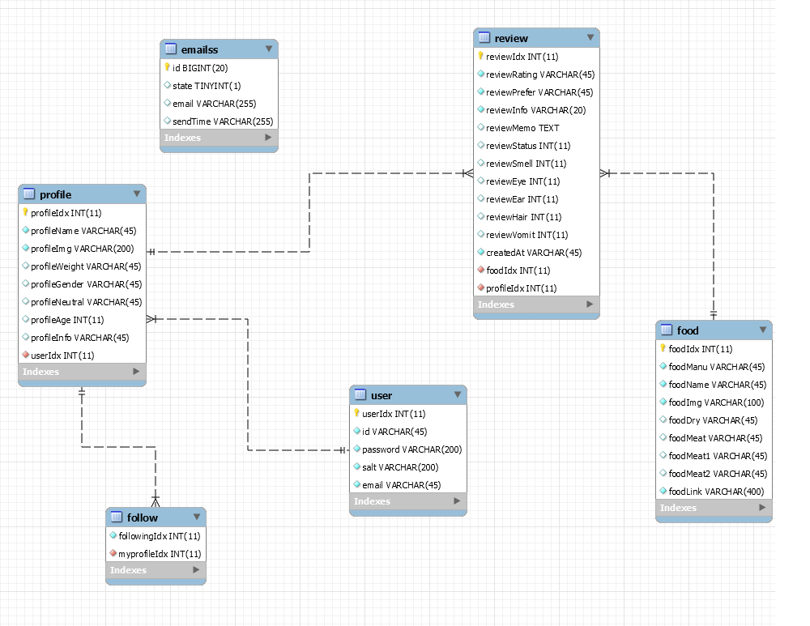

# Ounce


## :rainbow: :unicorn: Peaceful Server Team :unicorn: :rainbow:


<br>


### :open_file_folder: 기능 명세서 및 역할 분담


<br>

### :computer: package.json

```
"dependencies": {
    "cookie-parser": "~1.4.4",
    "debug": "~2.6.9",
    "express": "~4.16.1",
    "http-errors": "~1.6.3",
    "jade": "~1.11.0",
    "jsonwebtoken": "^8.5.1",
    "morgan": "~1.9.1",
    "multer": "^1.4.2",
    "nodemon": "^2.0.4",
    "pbkdf2": "^3.0.17",
    "promise-mysql": "^4.1.3",
    "rand-token": "^1.0.1",
    "pbkdf2": "^3.0.17",
    "promise-mysql": "^4.1.3"",
    "hangul-chosung-search-js": "^1.1.3",
    "hangul-js": "^0.2.6",
    "http-errors": "~1.6.3",
    "inko": "^1.1.1",
    "multer-s3": "^2.9.0",
    "aws-sdk": "^2.696.0",

  }
```

<br>

### :crystal_ball: ERD 



<br>

###  :paperclip: 핵심기능 설명


####  - 캣푸드 리뷰 기록 :pencil2:
: 고양이에게 먹여본 제품을 다양한 기준으로 빠르게 기록합니다.
 
 
####  - 서로의 리뷰 공유 :page_facing_up:  
: 제품마다 남겨진 리뷰들을 모아볼 수 있고, 고양이 계정을 서로 팔로우합니다.


####  - 입맛이 비슷한 고양이 추천  :cat:  
: 내 고양이가 남긴 리뷰들의 평점을 기반으로
입맛이 비슷한 고양이를 찾아 유사도와 함께 보여줍니다.


<br>


### :eyes: 팀별 역할분담

<table>
    <tr align="center">
        <td><B>팀원<B></td>
        <td width="200"><B>역할<B></td>
        <td><B>개인 목표<B></td>
    </tr>
    <tr align="center">
        <td>
            
            <br>
            <a href="https://github.com/Jeong-Hyowon"><I>정효원</I></a>
        </td>
        <td width="200">필터,정렬,추천</a></td>
        <td>대상</td>
    </tr>
    <tr align="center">
        <td>
            
            <br>
            <a href="https://github.com/yezgoget"><I>손예지</I></a>
        </td>
        <td width="200">유저,프로필</a></td>
        <td>인기상</td>
    </tr>
    <tr align="center">
        <td>
            
            <br>
            <a href="https://github.com/wjdrbs96"><I>최정균</I></a>
        </td>
        <td width="200">검색</a></td>
        <td>MVP</td>
    </tr>
</table>
